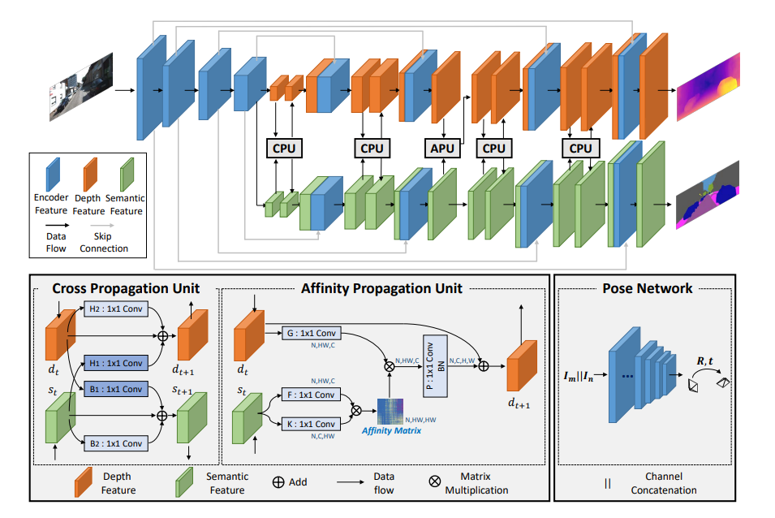

# SAFENet-Pytorch
## Pytorch implementation of SAFENet: Self-Supervised Monocular Depth Estimation with Semantic-Aware Feature Extraction

</img>

```python
import torch
from safenet import SAFENet

model = SAFENet(in_channels= 3, classes= 20)

img = torch.randn((1, 3, 224, 224)) / input image shape : (1, 3, 224, 224)
print(model(img).shape) / (1, 20, 224, 224)
```
